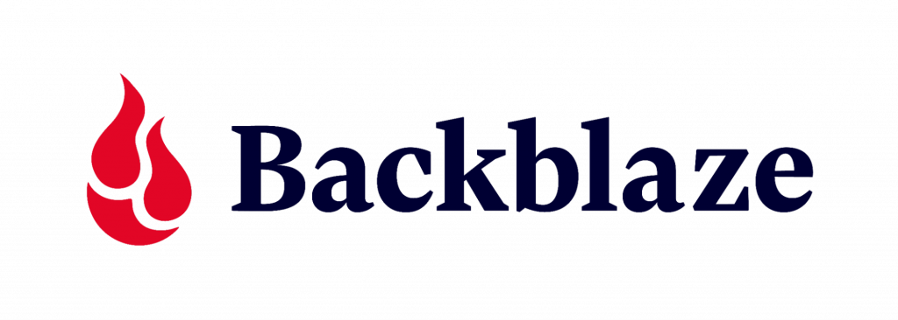
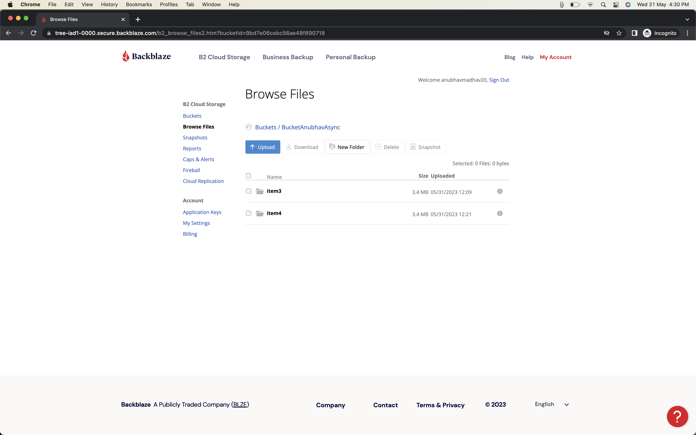
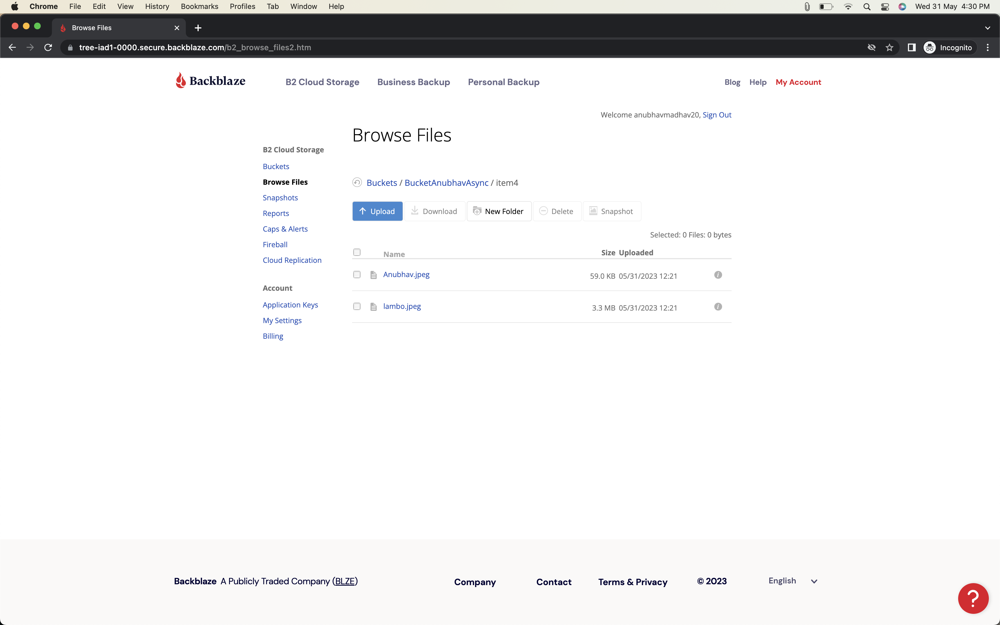
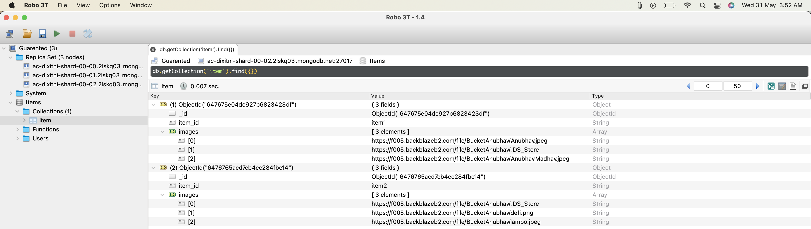

# Guarented-Assignment
## This repository is for the assignment submission to Guarented.

## This is a python project, which uploads files in a given folder to Cloud and also updates the same data on MongoDB using mongoengine.

---

---
This project is developed using Python 3.11.3.

---

Assignment Submission for Guarented: 

---
Cloud Service: Backblaze
---

---

## Demo Video: [Watch Here](https://drive.google.com/file/d/1UPrEVpTlDTWMw0zLZNLI4spf8uuK6YC7/view?usp=sharing)
---

## **How to use**: 
### - Clone this repository on your local system.
### - `cd` to this project directory.
### - Run command `pip install -r requirements.txt`. This will install all the necessary python libraries which are required to run this code.
### - Too read code, open it in any of your favourite code editor. For e.g. VSCode, Atom, PyCharm etc.
### - All the samples images are stored in the "dirs" directory.
### - You can find multiple folders like "item1", "item2" upto "item7", each one consisting of sample images to upload on Cloud.
### - Now, we have 3 python files in the root directory.
##### - 1. googleCloud.py -> Requires your Google Cloud Credentials. Details written as comment in code file as a NOTE.
##### - 2. backblaze.py -> ApplicationKey, keyId and bucketName are all written in code itself.
##### - 3. backblazeAsync.py -> Asynchronous uploading of files on backblaze b2 cloud storage.

### - Replace "item_id" in code with something like "item5" or "item7" or create "item9" onwards with images of your choice in the "dirs" yourself.

### - Run the code file of your choice. Let's say if you wish to run "backblazeAsync.py", run the command `python3 backblazeAsync.py`.

### - You can verify that the files have been uploaded to the Backblaze Cloud and the publicURLs of the images will get updated in the MongoDB "item" collection which can be verified on MongoDB Atlas or even on Robo3T as can be clearly seen in the `images` directory.

--- 

### NOTE: In order to run `googleCloud.py` file, you are supposed to enter your Credentials for Google Cloud.
#### 1. Provide path to your service account key for "GOOGLE_APPLICATION_CREDENTIALS"
#### 2. Enter name of the Google Cloud Storage Bucket in "bucket_name"

---
## Programming Language:   
 
---
## Technologies Used: Cloud Storage and Database.

---

## Libraries: **b2sdk**, **mongoengine**, **asyncio** and **google-cloud-storage**.
---
## Cloud:   

---

## Database:    

---

## Preview:
### 1. Backblaze Cloud Bucket Items

### 2. Backblaze Cloud Bucket Files

### 3. MongoDB Atlas Items Updated

### 4. Robo3T Items Updated

---

Connect with me on LinkedIn: [Anubhav Madhav](https://www.linkedin.com/in/anubhav-madhav/) 

### Thank You!!